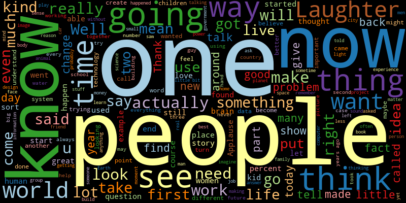
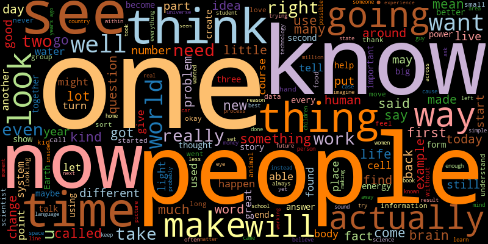
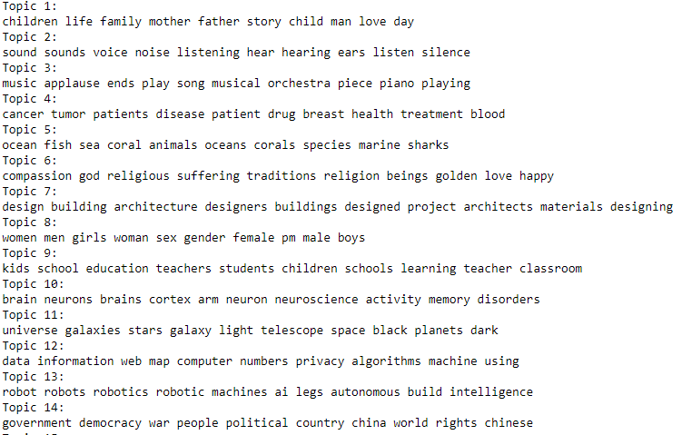

# TOOL1_FINAL_PROJECT
Final Project submission for COMP 4447 at University of Denver Online Data Science Masters Program

# Analysis of TED Talks using NLP

For my COMP 4447 Final Project, I will be using Natural Language Processing to analyze and interpret the contents of TED talks. My analysis will include understanding why stopwords are crucial for preprocessing, visualizing the word distributions including the most frequently spoken words using word clouds, , n-grams and Topic Modeling using TFIDF (Term Frequency Inverse Document Frequency) and NMF (Non-negative Matrix Factorization).

## Data

This repo does contain any data. The collection of the extracted narratives from TED (TED, TEDx, TEDEd) talks, that has been forked from [here](https://github.com/saranyan/TED-Talks).

## Natural Language Processing

There are limitless number of things one could achieve with NLP. I will attempt to perform the following:
* Word Cloud generation
* n-grams analysis
* Topic Modeling using TFIDF and NMF

## Word-Cloud Generation

> A picture is worth a thousand words. 

Word-clouds are brilliant ways to visualize the content of a large body of text. Here is a simple word-cloud from TED talks.

It seems like TED talkers use empowering words like 'now' and 'one' to conjure curiosity amongst the audience. Majority of the talks seem to be funny with the inclusion of 'laughter'.
Let's take a look at TED-ED word-cloud now

It's really interesting to see the massive use of 'people' as it implies that TED-ED talkers mention communties a whole lot more. Also notice words like 'time' and 'know' possibly indicating the relationship between knowledge and the importance of time. Amongst these words standing out from the rest, we can still notice academic words of context like 'fact','make','thought','life' etc. 

### n-grams

We will take a look at the distribution of n-grams throughout the transcripts of TED talks. We will be examining bigrams, trigrams and quadgrams.

## Topic Modeling using TFIDF and NMF

Given the diverse selection of TED talks to watch/read, is it possible to generalize into simple categories?

My Topic Modeling model (NMF) seems to derive these topics. We can notice that **Topic 11** talks about universe, stars and galaxies, **Topic 13** is about robotics, **Topic 2** is about listening and sound while **Topic 3** is regarding songs and music.

## Next Steps

My next step would be building a recommendation engine that is capable of detecting the topic a TED talk belongs to and recommends similar TED talks based on the same topic.

